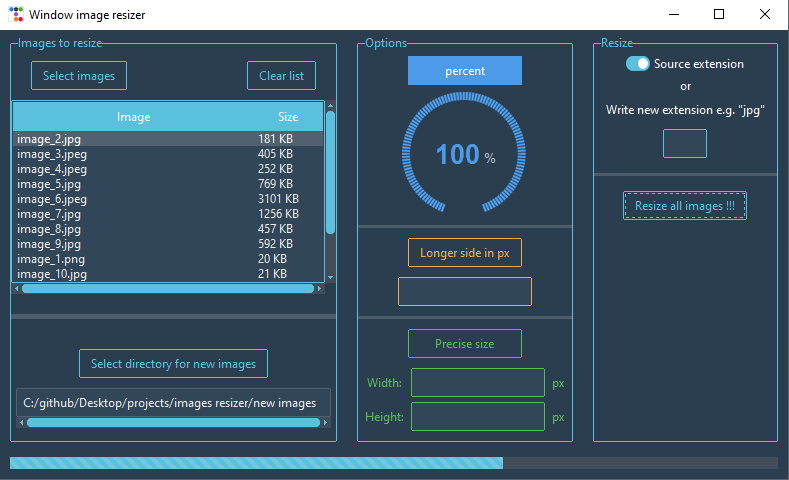

## Image resizer
Simple gui app to change image size and extension.

### Table of contents
* [Requirements](#required-libraries)
* [Description](#description)
* [Methods](#methods)

### Required libraries
* Pillow==9.4.0
* tk==0.1.0
* ttkbootstrap==1.10.1

### Description
The program changes size of image and extension. You can leave the default extension or use your own, e.g. png, jpg.\
Images are loaded using the `exif_transpose()` method from the `PIL` library. This ensures that images have the correct orientation.\
If you want only change to extension set value to `100` in first resize method.

### Methods:
* Percentage reduction of photo. The specified value is a percentage of original dimension of photo. The original proportions of photo are preserved.
* Specifying the value in pixels of the longer side of photo. The original proportions of photo are preserved.
* Specifying the exact values of the sides of photo. The original proportions are not preserved.

